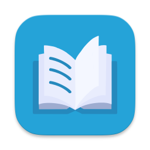

# reader

reader is a simple book-tracking app I created in SwiftUI for personal use and to share with a friend. It helps keep track of books in different reading stages and lets users save favorite quotes and notes.

## Features

- Status Section: Easily categorize books by reading status:
  - Unread
  - Reading
  - Read
- Quotes Section: Save quotes from each book.
- Notes Section: Write personal notes about specific passages in the book.
- Search, sort, and filter: Search, sort, or filter your books by author, genre, published date, or reading status.

## Installation

To install, follow these steps:

1. Go to the Releases section of this repository.
2. Download the latest `.zip` file containing the **reader** app.
3. Extract the `.zip` file to access the app.
4. Move the app to your Applications folder (optional).

**Note**: Since reader is not notarized, you may need to bypass macOS security warnings:

- Right-click or control-click the app icon and select open.
- If prompted with a security warning, confirm that you want to open the app from an 'unidentified developer.'

## Permissions

reader requires network permissions to fetch book data from the Google Books API. This allows you to retrieve book details automatically, making it easier to add new books to your reading list.

## Contributing

Contributions are welcome! If you’d like to contribute or improve reader, please follow these steps:

1. Fork the repository and create your feature branch.
2. Make your changes and commit them with clear messages.
3. Push your branch and create a pull request.

If you have any suggestions or feedback, feel free to reach out or open an issue. Thank you for helping to improve reader!
